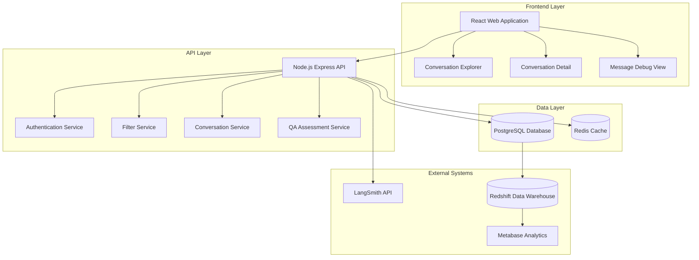

# Design Document: AI Eval & QA Console

## Overview

The AI Eval & QA Console is a web-based application that provides a comprehensive interface for reviewing, debugging, and improving AI chatbot conversations. The system consists of a React frontend with three main views (Conversation Explorer, Detail View, and Debug View) backed by a Node.js API server and PostgreSQL database. The architecture emphasizes performance, scalability, and integration with existing Amber infrastructure including Redshift data warehouse and Metabase analytics.

## Architecture

### High-Level Architecture



### Technology Stack

- **Frontend**: React 18 with TypeScript, Tailwind CSS for styling
- **Backend**: Node.js with Express.js and TypeScript
- **Database**: PostgreSQL (primary), Redis (caching)
- **Data Warehouse**: Redshift (existing infrastructure)
- **Analytics**: Metabase (existing infrastructure)
- **Authentication**: JWT-based authentication
- **External Integration**: LangSmith REST API

## Components and Interfaces

### Frontend Components

#### ConversationExplorer Component
- **Purpose**: Displays filterable list of conversations in inbox format
- **Key Features**: 
  - Multi-criteria filtering (CSAT, intent, channel, date, etc.)
  - Pagination for large datasets
  - Real-time search
- **State Management**: React Query for server state, Zustand for UI state
- **Performance**: Virtual scrolling for large conversation lists

#### ConversationDetail Component
- **Purpose**: Shows complete conversation with QA tools
- **Layout**: Split-pane design (chat on left, metadata/QA on right)
- **Key Features**:
  - WhatsApp-like message bubbles
  - Inline QA rating and tagging
  - Reviewer notes with rich text editor
- **Real-time Updates**: WebSocket connection for live conversation updates

#### MessageDebugView Component
- **Purpose**: Deep inspection of individual message processing
- **Key Features**:
  - Expandable debug panels
  - Syntax highlighting for prompts and responses
  - Performance metrics visualization
  - Direct links to LangSmith traces

### Backend Services

#### Authentication Service
- **Endpoints**: `/auth/login`, `/auth/verify`, `/auth/logout`
- **Security**: JWT tokens with 8-hour expiration
- **Integration**: Connects with existing Amber user directory

#### Conversation Service
- **Endpoints**: 
  - `GET /conversations` - List with filtering
  - `GET /conversations/:id` - Detailed conversation data
  - `GET /conversations/:id/messages/:messageId/debug` - Message debug info
- **Caching**: Redis cache for frequently accessed conversations
- **Performance**: Database indexing on filter columns

#### QA Assessment Service
- **Endpoints**:
  - `POST /conversations/:id/rating` - Set conversation rating
  - `POST /conversations/:id/tags` - Add/update tags
  - `POST /conversations/:id/notes` - Add reviewer notes
- **Audit Trail**: All QA actions logged with timestamps and user info

#### Filter Service
- **Purpose**: Handles complex multi-criteria filtering
- **Features**:
  - Dynamic query building
  - Filter combination logic
  - Performance optimization for large datasets

## Data Models

### Core Entities

#### Conversation
```typescript
interface Conversation {
  id: string;
  channel: 'website' | 'whatsapp';
  startTime: Date;
  endTime: Date | null;
  participantCount: number;
  aiAgentVersion: string;
  promptVersion: string;
  kbVersion: string;
  detectedIntent: string | null;
  outcome: 'qualified' | 'dropped' | 'escalated' | 'ongoing';
  csat: 'good' | 'bad' | null;
  humanHandover: boolean;
  autoSummary: string | null;
  createdAt: Date;
  updatedAt: Date;
}
```

#### Message
```typescript
interface Message {
  id: string;
  conversationId: string;
  sender: 'user' | 'ai' | 'human';
  content: string;
  timestamp: Date;
  messageType: 'text' | 'image' | 'file' | 'system';
  processingLatency: number | null;
  langsmithTraceId: string | null;
  promptUsed: string | null;
  ragContext: string | null;
  modelOutput: string | null;
  toolCalls: ToolCall[] | null;
  errors: string[] | null;
}
```

#### QAAssessment
```typescript
interface QAAssessment {
  id: string;
  conversationId: string;
  reviewerId: string;
  rating: 'good' | 'okay' | 'bad';
  tags: string[];
  notes: string | null;
  createdAt: Date;
  updatedAt: Date;
}
```

#### ToolCall
```typescript
interface ToolCall {
  toolName: string;
  input: Record<string, any>;
  output: Record<string, any>;
  duration: number;
  success: boolean;
}
```

### Database Schema

#### PostgreSQL Tables
- `conversations` - Core conversation data with indexes on filter columns
- `messages` - Individual messages with full-text search capabilities
- `qa_assessments` - Quality assessment data with audit trail
- `users` - Reviewer user accounts and permissions
- `conversation_tags` - Many-to-many relationship for tagging
- `filter_presets` - Saved filter configurations for users

#### Indexing Strategy
- Composite indexes on frequently filtered columns (channel, csat, date)
- Full-text search index on message content
- Foreign key indexes for join performance

## Error Handling

### Frontend Error Handling
- **Network Errors**: Retry logic with exponential backoff
- **Authentication Errors**: Automatic redirect to login
- **Data Loading Errors**: Graceful fallbacks with user-friendly messages
- **Validation Errors**: Inline form validation with clear error messages

### Backend Error Handling
- **Database Errors**: Connection pooling with automatic retry
- **External API Errors**: Circuit breaker pattern for LangSmith integration
- **Authentication Errors**: Standardized error responses with appropriate HTTP codes
- **Validation Errors**: Detailed error messages for API consumers

### Error Monitoring
- Structured logging with correlation IDs
- Error aggregation and alerting
- Performance monitoring for slow queries

## Testing Strategy

The testing approach combines unit tests for specific functionality with property-based tests to verify universal system behaviors across all inputs.

### Unit Testing
- **Component Tests**: React Testing Library for UI components
- **API Tests**: Jest with supertest for endpoint testing
- **Database Tests**: Test database with transaction rollback
- **Integration Tests**: End-to-end user workflows

### Property-Based Testing
Property-based tests will validate universal correctness properties using fast-check library for comprehensive input coverage. Each test will run a minimum of 100 iterations to ensure thorough validation.

## Correctness Properties

*A property is a characteristic or behavior that should hold true across all valid executions of a system—essentially, a formal statement about what the system should do. Properties serve as the bridge between human-readable specifications and machine-verifiable correctness guarantees.*

### Property 1: Conversation Filtering Accuracy
*For any* combination of filter criteria (CSAT, intent, channel, date range, agent version, handover status), all returned conversations should match ALL applied filter criteria simultaneously.
**Validates: Requirements 1.2, 1.3, 1.4, 1.5, 1.6, 1.7, 1.8**

### Property 2: Message Chronological Ordering
*For any* conversation with multiple messages, the messages should be displayed in chronological order based on their timestamps.
**Validates: Requirements 2.2**

### Property 3: QA Data Persistence
*For any* conversation and any valid QA action (rating, tags, notes), performing the action should result in the data being stored and retrievable with the conversation.
**Validates: Requirements 2.4, 2.5, 2.6**

### Property 4: Metadata Display Completeness
*For any* conversation, all required metadata fields (summary, intent, outcome, agent versions) should be displayed when viewing conversation details.
**Validates: Requirements 2.3, 2.7**

### Property 5: Message Debug Information Access
*For any* message with debug data, inspecting the message should display all available debug information (prompt, RAG context, model output, tool calls, metrics).
**Validates: Requirements 3.1, 3.2, 3.3, 3.4, 3.5**

### Property 6: LangSmith Link Generation
*For any* message with a valid LangSmith trace ID, the system should generate a properly formatted deep link to the corresponding trace.
**Validates: Requirements 3.6**

### Property 7: Data Integrity Preservation
*For any* conversation data being stored or imported, all original information (timestamps, participants, messages, metadata) should be preserved without corruption.
**Validates: Requirements 4.1, 4.2, 4.3**

### Property 8: Audit Trail Creation
*For any* QA data modification, an audit record should be created with the change details, timestamp, and user information.
**Validates: Requirements 4.4**

### Property 9: Authentication Enforcement
*For any* system access attempt, authentication should be required and unauthorized requests should be properly rejected with appropriate redirects.
**Validates: Requirements 5.1, 5.2, 5.3**

### Property 10: User Action Logging
*For any* user action within the system, an audit log entry should be created with the action details and user information.
**Validates: Requirements 5.4**

### Property 11: Pagination Functionality
*For any* large conversation dataset, pagination should correctly divide the results and allow navigation through all pages without data loss or duplication.
**Validates: Requirements 6.4**

### Property 12: Caching Behavior
*For any* frequently accessed data, subsequent requests should utilize cached data when appropriate, improving response times without compromising data accuracy.
**Validates: Requirements 6.5**

### Property 13: Data Import Processing
*For any* valid conversation data from external systems, the import process should successfully process and store the data in the correct format.
**Validates: Requirements 7.1, 7.4**

### Property 14: External Integration Synchronization
*For any* valid LangSmith trace request, the system should successfully retrieve and synchronize the trace data.
**Validates: Requirements 7.2**

### Property 15: Error Handling Resilience
*For any* external system integration failure, the system should log the error and continue operating with available data without crashing.
**Validates: Requirements 7.5**

### Property-Based Testing Configuration

All property-based tests will be implemented using the fast-check library for TypeScript/JavaScript with the following configuration:
- **Minimum 100 iterations** per property test to ensure comprehensive input coverage
- **Test tagging format**: `Feature: ai-eval-console, Property {number}: {property_text}`
- **Generator strategy**: Smart generators that constrain inputs to valid system states
- **Error handling**: Property tests will help identify edge cases in error conditions

### Unit Testing Strategy

Unit tests will complement property-based tests by focusing on:
- **Specific examples**: Known good/bad conversation scenarios
- **Edge cases**: Empty datasets, malformed data, boundary conditions  
- **Integration points**: API endpoints, database operations, external service calls
- **Performance examples**: Specific timing requirements (2-second load times, 1-second filter updates)
- **Error conditions**: Network failures, authentication errors, data validation failures

The combination of property-based tests (universal behaviors) and unit tests (specific examples) ensures comprehensive coverage of both general correctness and specific edge cases.